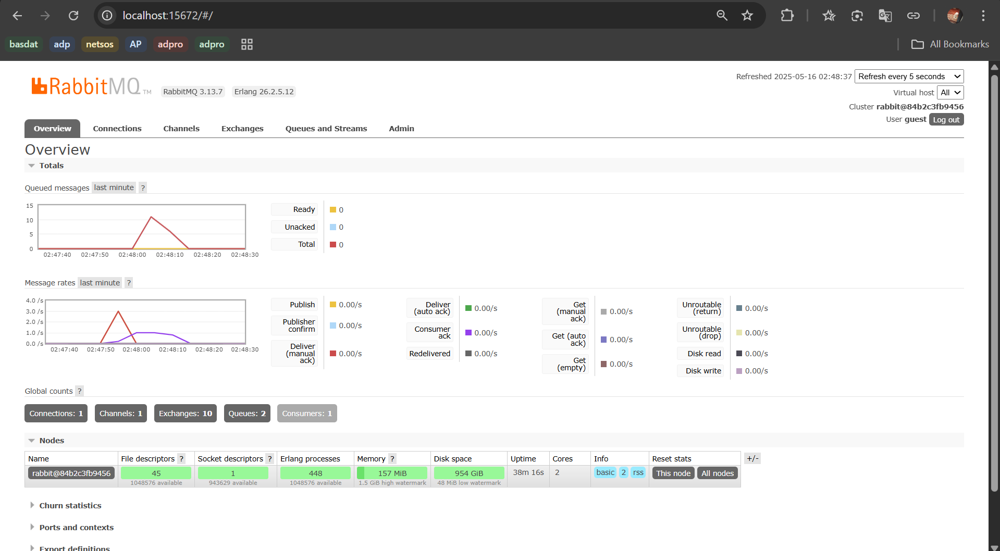

# Module 9 Tutorial: Software Architecture

Advanced Programming (Even Semester 2024/2025) Tutorial Module 9

Khansa Khairunisa - 2306152462

## Reflection

>1. What is amqp?

AMQP (Advanced Message Queuing Protocol) adalah sebuah protokol komunikasi yang digunakan untuk sistem antrian pesan (*message queue*). Protokol ini memungkinkan berbagai aplikasi untuk saling berkomunikasi dengan cara mengirim dan menerima pesan secara *asynchronous* melalui perantara seperti broker (misalnya RabbitMQ). AMQP dirancang agar dapat diandalkan, mendukung antrean, pengiriman terjamin, dan cocok untuk arsitektur sistem yang membutuhkan pemrosesan data secara paralel atau terpisah antar komponen.

>2.  What does it mean? `guest:guest@localhost:5672`, what is the first guest, and what is the second guest, and what is `localhost:5672` is for?

Bagian `guest:guest@localhost:5672` adalah format URL koneksi ke broker AMQP (misalnya RabbitMQ). Kata pertama guest sebelum titik dua adalah username, dan guest kedua adalah password-nya. Sedangkan localhost berarti broker dijalankan di komputer lokal (bukan server luar), dan 5672 adalah nomor port default untuk koneksi AMQP. Jadi secara keseluruhan, format ini menunjukkan bahwa kita terkoneksi ke broker RabbitMQ lokal menggunakan user guest dan password guest melalui port 5672.

- **Simulation Slow Subscriber**

Gambar berikut menunjukkan antrean pesan (queue) yang terbentuk saat `publisher` dijalankan beberapa kali secara cepat, sementara subscriber diperlambat dengan delay (thread::sleep). Dalam kasus saya, total antrean mencapai 10 karena setiap eksekusi `publisher` mengirim 5 pesan dan saya menjalankannya dua kali sebelum `subscriber` selesai memproses semuanya.

